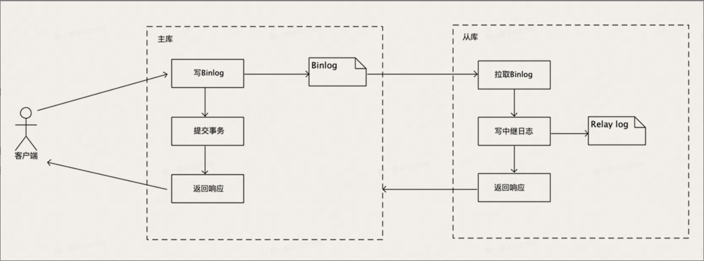
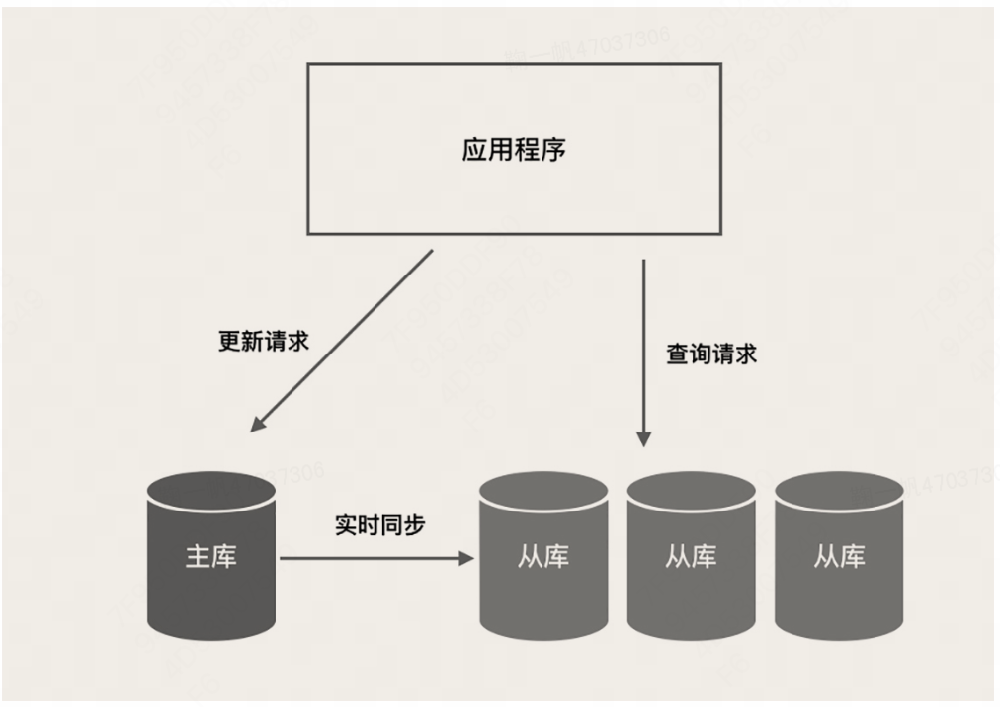
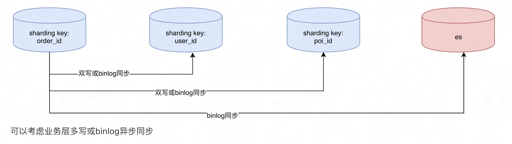

# Mysql

[TOC]

一些基础的，如mysql的语句撰写、关键字等等，不赘述，主要是：

1、update语句、select语句、insert语句、delete语句（索引操作类、建表类、删表类可以先不看）

2、多表连接需要会写，left join、on

3、关键字常用的会就行，比如where、in、or、group by分组、having、count、max、sum、order by、desc、asc

ps：desc、asc只会对前一个字段生效，不会对多个字段生效，如order by a,b desc，结果是a升序，b降序

## 数据库三范式 反范式

| 数据库三范式是关系数据库设计的基本原则，目的是减少数据冗余，同时尽量保证数据的完整性和一致性 |
| ------------------------------------------------------------ |
| 第一范式（1NF）：每一列都是不可分割的基本数据项，同一列中的值都是相同类型，每一行都是唯一的（即每一行都有一个唯一的标识，通常是主键）。 |
| 第二范式（2NF）：在第一范式的基础上，要求数据库表中的每一列都和主键直接相关，而不能间接相关。也就是说，一个表中只能保存一种数据，不可以把多种数据混在一起。 |
| 第三范式（3NF）：在第二范式的基础上，要求一个数据库表中不包含已在其它表中已包含的非主键信息。也就是说，非主键列必须直接依赖主键，不能存在传递依赖。 |

在实际应用中，为了追求更好的查询性能，可以适当违反这些范式，比如一定程度上进行数据冗余。

 

## varchar和char、int（1）和int（10）

| varchar   | 可变长度的字符数据类型，一个varchar(N)类型的字段会根据实际字符串的长度来分配存储空间，只占用实际长度+1或2（用于存储字符串长度）的空间。VARCHAR类型适合存储长度可变的字符串，如地址、描述等。 |
| --------- | ------------------------------------------------------------ |
| char      | 固定长度的字符数据类型，当一个char(N)类型的字段存储长度小于N的字符串时，会在字符串的右侧用空格填充至N个字符；当存储长度大于N的字符串时，会截断超过的部分。char类型适合存储长度固定的字符串，如性别、国家代码等。 |
|           | 那是不是直接都使用varchar最好？节省空间  不完全是这样，如果列的长度评估基本相近，适合使用定长类型，效率更高 |
| int（1）  | int(1)和int(10)的区别并不是它们可以存储的值的范围，而是显示的宽度（了解就行，不常用）  无论是int(1)还是int(10)，它们都是整数类型，可以存储的值的范围是-2147483648到2147483647（如果是无符号，即UNSIGNED，则为0到4294967295）。  显示宽度在使用ZEROFILL属性时才有意义，ZEROFILL会在数字的左边添加零，如int(5) ZEROFILL列，插入45，查询会返回00045 |
| int（10） |                                                              |
|           | 延伸一下，mysq还有哪些其他类型，说说认知  数值类型：包括整数类型（如TINYINT、SMALLINT、MEDIUMINT、INT、BIGINT）、浮点数类型（如FLOAT、DOUBLE）、定点数类型（如DECIMAL）等。  字符串类型：包括字符类型（如CHAR、VARCHAR）、文本类型（如TINYTEXT、TEXT、MEDIUMTEXT、LONGTEXT）、二进制类型（如BINARY、VARBINARY）、二进制大对象类型（如TINYBLOB、BLOB、MEDIUMBLOB、LONGBLOB）等  日期和时间类型：包括DATE、TIME、YEAR、DATETIME、TIMESTAMP等。  空间类型：用于存储地理空间信息，如GEOMETRY、POINT、LINESTRING、POLYGON等。  JSON类型：用于存储和管理JSON格式的数据。 |

## 数据库索引类型

### 索引的存储结构

从索引的存储结构上来讲，分为聚簇、非聚簇

| 类型   | 描述                                                         |
| ------ | ------------------------------------------------------------ |
| 聚簇   | 聚簇索引将数据存储与索引放在一起，根据主键的顺序来存储       |
| 非聚簇 | 非聚簇索引的存储与数据存储是分开的，索引结构只包含字段的值和数据的位置信息 |

### 索引的数据结构

从索引的数据结构上来讲，分为B-Tree索引、Hash索引、Bitmap索引

| 类型       | 描述                                                         |
| ---------- | ------------------------------------------------------------ |
| B-Tree索引 | 适用于全值匹配、范围查询、前缀匹配                           |
| Hash索引   | 适用于等值查询（mysql中不支持支持创建）                      |
| Bitmap索引 | Bitmap索引适用于区分度较低的列，即列中不同值的数量相对较少（mysql中不支持支持创建）  一般用于OLAP场景，不适应于实时数据读写场景，因为底层是位图存储，更新场景较多时重建Bitmap开销大 |

### 索引类型

从索引类型上，可以分为，单列索引（主键索引）、多列联合索引（覆盖索引）、全文索引

| 类型               | 描述                                                         |
| ------------------ | ------------------------------------------------------------ |
| 单列索引  主键索引 | 单行列添加索引，主键索引是特殊的单行索引                     |
| 联合索引  覆盖索引 | 多列构成索引，怎么去构造多列索引呢，一般来说：  1、区分度越高的应该放在前面，2、最常用作查询条件的列放在索引的最左边  覆盖索引是特殊的多列索引，用于解决索引回表问题，非聚簇索引找到数据具体位置后，还需要找一次聚簇索引获取具体数据 |
| 全文索引           | 全文索引主要用于全文搜索，适用于大文本内容的查找  不常用，一般使用ES做分词全文检索 |

### innodb索引数据结构，B+树

B+树是一种自平衡的多路搜索树，它的特点是所有的叶子节点都在同一层，且每个叶子节点都包含了全部的键值信息和对应的记录的地址。

非叶子节点仅作为路由，不包含实际的键值信息，这使得查询效率更加稳定。

InnoDB存储引擎的主键索引（聚簇索引）和非主键索引（二级索引）都是使用B+树实现的。

这里讲的很细且清晰：https://blog.csdn.net/liang921119/article/details/130638188

总结来说，B+树就是用来快速搜索符合条件的数据在磁盘中的记录位置

对于主键索引，非叶子节点的KEY根据ID进行排序和查找，VALUE是数据页的位置，叶子节点存储的KEY是ID，VALUE是数据页的内容（里面存的是具体记录）

对于非主键索引，非叶子节点的KEY根据索引字段进行排序和查找，VALUE是数据页的位置，叶子节点存储的KEY是索引字段，VALUE是数据页的内容（里面存的是主键ID）

 

**既然其余非主键索引都有回表需求，为什么主键索引不做个hash索引映射呢，还使用B+树？**

1、hash索引不支持范围查询

2、hash有一定概率冲突，需要解决

 

 

## 索引失效、索引优化、索引回表

| 问题                                                         | 解答                                                         |
| ------------------------------------------------------------ | ------------------------------------------------------------ |
| 什么场景下索引会失效                                         | 1、使用函数或表达式，比如 a/b  2、使用不等于  3、使用like+通配符，比如like '%abc'  4、使用or |
| sql中查询条件顺序重要吗  有ab、ac 索引，where d = '' and a ='' 索引会生效吗 | 1、查询优化器会自行优化sql语句，一般情况下不重要，但是建议按索引条件组织  2、最左前缀原则，a会生效 |
| 有过索引优化经验吗                                           | 有，可以通过explain获取sql执行计划，然后从以下角度分析优化  1、合理评估索引类型  2、合理利用最左前缀原则（区分度高、查询频率高的应位于索引前列）  3、避免使用函数、表达式  4、尽量避免多表连接、子查询 |
| 索引回表问题了解么                                           | 覆盖索引解决                                                 |

## sql效率如何评估

使用explain评估sql执行计划，常用的评估字段如下

| 问题              | 解答                                                         |
| ----------------- | ------------------------------------------------------------ |
| id                | 查询的标识符，如果是单表查询，id通常为1。对于复杂的查询，可能包含多个id，id的值越大，表示执行优先级越高，越先被执行。 |
| select_type       | 查询的类型，常见的有SIMPLE（简单查询，不包含子查询或者UNION）、SUBQUERY（子查询中的第一个SELECT）、DERIVED（派生表的SELECT, FROM子句的子查询）等。 |
| table             | 输出结果集的表                                               |
| type（需了解）    | 表示MySQL在表中找到所需行的方式，常见的有  const（表示MySQL能够在索引中一次就找到）  eq_ref（唯一性索引扫描）  ref（这种类型表示只有根据前面的表的列值，才能读取固定数量的行）  range（范围扫描）  index（全索引扫描，就是没回表）  ALL（全表扫描） |
| possible_keys     | 可能用于查询的索引                                           |
| key（需了解）     | 实际使用的索引。如果为NULL，则没有使用索引。                 |
| key_len（需了解） | 使用的索引的长度。在不损失精确性的情况下，长度越短，代表检索越快。 |
| ref               | 显示索引的哪一列被使用了，如果可能的话，是一个常数。         |
| rows（需了解）    | MySQL认为必须检查的用来返回请求数据的行数。                  |
| Extra             | 关于查询的额外信息，如：  Using where（表示MySQL服务器将在存储引擎检索行后再进行过滤）  Using  temporary（表示MySQL需要使用临时表来存储结果集）  Using  filesort（表示MySQL会对结果使用一个外部的索引排序，而不是按照表内的索引顺序进行读取） |

 

## 事务的ACID特性

原子性（同时成功或失败）、隔离性（事务间独立）、持久性（事务提交后永久存储）、一致性（数据在业务上需要一致）

### 原子性

原子性怎么实现，在innodb中是基于undo-log日志

undo-log日志记录了事务操作中的数据变更日志，主要包括两种，insert-log和update-log（为什么没有delete-log，delete-log用update-log实现了）

用于：1、事务操作失败时回滚，2、mvcc版本快照读中用undo-log日志链来实现一致性读视图和版本判断

### 隔离性

隔离性怎么实现，事务的隔离级别

| 隔离级别 | 解释                                     | 带来的问题     | 解决                                                         |
| -------- | ---------------------------------------- | -------------- | ------------------------------------------------------------ |
| 未提交读 | 一个事务读取到另一个事务未提交的数据     | 脏读问题       |                                                              |
| 已提交读 | 一个事务读取到另一个事务已提交的数据     | 不可重复读问题 | 通过悲观读写锁来实现，读操作加共享读锁，读完释放，事务写操作加排他写锁，提交后释放 |
| 可重复读 | 当前事务未commit则读取不到其余事务的改动 | 幻读问题       | 通过MVCC快照读和加行锁、间隙锁来实现  MVCC针对的是读写冲突，为了提高并发效率，是一种乐观锁实现  MVCC的实现原理：  通过事务版本号实现，每行记录增加新建版本号和删除版本号，当前事务只能看到新建版本号比自己小的，且删除版本号为空或比自己大的（比自己大证明是旧数据）  innodb的MVCC实现方式：事务ID + undo  log的指针  根据以下规则判断数据行是否可见：如果行事务ID小于当前事务ID，那么这个版本的数据行就可能可见。但是还需要判断这个事务在修改数据时是否已经提交，如果已经提交，那么数据行对当前事务可见；如果未提交，那么需要通过undo log来产生一个可见的快照。如果行事务ID大于事务的ID，那么这个版本的数据行对于当前事务不可见，需要通过undo log来产生一个可见的快照。  行锁、间隙锁（锁记录的上下行间隙）针对的是写写冲突，尽量保证多事务写操作的数据不受互相影响 |
| 串行化   | 对所有读取的数据加锁，粒度较大           |                |                                                              |

### 持久性

持久性怎么实现，redo-log

| 策略                                                         |
| ------------------------------------------------------------ |
| Redo Log（重做日志）：InnoDB会在事务执行过程中，将所有的数据修改操作（包括插入、删除、更新等）写入到Redo Log中。当事务提交时，只需要将Redo Log持久化到磁盘，而不需要立即将数据页写回到磁盘。这样就可以大大提高了事务的执行效率。如果系统崩溃，可以通过重做日志来恢复数据。 |
| Write-Ahead  Logging（预写式日志）：这是一种日志先行策略，即在修改数据之前，先将日志记录到磁盘。这样在系统崩溃后，即使数据没有来得及写入磁盘，也可以通过日志来恢复数据。  也就是所谓的二段式提交，先日志后数据 |
| Checkpoint（检查点）：InnoDB会定期的将内存中的数据页和日志信息刷新（flush）到磁盘，这个操作称为做checkpoint。checkpoint可以减少系统崩溃恢复的时间，也能确保磁盘上的数据与内存中的数据保持一致。 |
| Doublewrite（双写）：为了防止在写入数据页到磁盘过程中发生部分写入的情况，InnoDB引入了doublewrite机制。在将数据页写入磁盘之前，先将数据页写入到doublewrite  buffer，然后再将doublewrite buffer中的数据写入到磁盘。这样即使在写入过程中发生错误，也可以通过doublewrite  buffer来恢复数据。 |

顺便提一下，**binlog是什么，和前两种log的区别**

binlog，是MySQL中服务层的一种日志文件，以二进制的形式记录了数据库执行的所有DDL和DML语句事件，以及这些事件发生的精确时间。

可以认为记录下增删改的操作日志，主要用于主从集群间数据同步（写操作写到主库，然后通过binlog同步到从库）、数据恢复

redo-log和undo-log，都是innodb引擎实现的，用于处理事务和并发控制的

 

## MyBatis（ORM映射框架，只是工具）中的# $

| #{}和${}都可以用于SQL语句中的占位符，但它们的处理方式不同    |
| ------------------------------------------------------------ |
| #{}：这是一个预处理语句（PreparedStatement）的参数占位符，MyBatis会将SQL中的#{}替换为?，然后通过PreparedStatement的set方法将参数值设置到SQL语句中。  这种方式可以有效防止SQL注入。（怎么理解呢？因为预处理语句是数据库提供预编译功能，在参数填充之前，sql语句结构已经固定了，不会受参数影响截断） |
| ${}：这是一个字符串替换的占位符，MyBatis会直接将${}替换为参数的字符串形式。这种方式不能防止SQL注入，所以在处理用户输入的数据时，应尽量避免使用${}。 |
| 参数是用户输入数据，使用#{}，以防止SQL注入  参数是服务内部控制的，可以使用${}，建议直接都使用#{} |

 

 

## 主从集群、读写分离、分库分表

### mysql的主从同步是怎么做的

| 模式       | 解释                                                         |
| ---------- | ------------------------------------------------------------ |
| 同步复制   | 主库的写操作等待从库返回复制的结果，才返回给客户端，保证强一致性  这种方式性能很差，尤其是当从节点多的情况下，需要等待所有从节点成功 |
| 异步复制   | 上图就是异步复制的流程，主库的写操作不会等待从库返回复制的结果，只要生产了binlog即可  这种方式性能较高，带来的问题是，如果从库复制失败，主从会产生数据不一致 |
| 半同步复制 | 半同步复制介于二者之间，主库的写操作不用等待所有的从库复制成功响应，只要一部分复制响应回来之后，就可以给客户端返回  这种方式兼顾了前面两者的优点，是比较常用的方式  一部分响应，这个响应节点数是怎么判定的呢？走配置，默认是1 |

 

 

### 读写分离怎么实现

主从同步和读写分离其实是相辅相成的，通过主从集群同步来实现了读写分离

主节点负责写操作，并把数据同步给从节点，从节点对外提供读操作访问

其中有个核心的动作是：需要区分请求的数据操作是读操作还是写操作，基于操作类型分流到不同的数据节点

常用组件方式：使用像Sharding-JDBC这种集成在应用中的第三方组件来实现，让组件代理你的程序中的所有数据库请求，自动把请求路由到对应数据库实例上。

具体实现是在GroupDataSource内部判断SQL语句是不是select，然后分别走到不同的SingleDataSource

### 如何解决主从延迟带来的数据一致性问题

1、配置主从复制为同步复制（实际上很难应用，效率太低）

2、考量业务场景，对于大部分场景，业务上可以接受一定程度的主从延迟

3、对于延迟高度敏感的场景，可以强制查主来解决（通过一定的标识，表明这条查询SQL必须走master实例）

 

 

### 数据量大的情况下，查询越来越慢，怎么解决

肯定不能靠堆从机器

1、数据定时清理（过期失效不用的数据做清理）

2、历史数据归档（过期的数据还有用，但是查询量很少，另起归档表）

3、分库分表（表还是很大，那该拆分了）

## 分库分表 

### 类型

一般有两种模式，垂直分表、水平分表

| 类型     | 解释                                                         |
| -------- | ------------------------------------------------------------ |
| 垂直分表 | 基于业务信息的相关性去垂直切分一张表  举个栗子：一张用户信息表中目前包含了用户身份信息、用户账号信息、用户扩展信息等，基于不同业务信息，切分为3张表  这种方式不常见，一般在初始设计时就会切分开，比较常见的情况是，给一张表增加一个扩展信息表 |
| 水平分表 | 基于一些分表键去水平切分一张表  举个栗子：一张用户信息表中目前有1000万用户，基于用户ID取模水平切分为10张表，每张表100万用户 |

###  拆分原则

一般来说，公认MySQL单表容量在1KW以下是最佳状态，因为这时它的BTREE索引树高在3~5之间。当单表的数量超过1kw，就可以考虑拆分了

| 条件                      | 方式 |
| ------------------------- | ---- |
| 单表空间>100G             | 分表 |
| 单表数据量>1000w          | 分表 |
| 单库磁盘IO/网络IO出现瓶颈 | 分库 |
| 单库QPS>1000              | 分库 |

### 分库分表如何做

1、选择分表键（sharding key）

sharding key的选取跟业务强相关，可以分析API流量，将流量比较大的SQL提取出来，将这些SQL共同的条件作为sharding key。

例如一般的OLTP系统都是对用户提供服务，这些SQL都有条件用户ID，那么，用户ID就是非常好的sharding key。

2、确定是否需要多个分表键（sharding key）

以订单表为例，查询流量最大是三个场景按照订单ID、用户ID、门店ID三个维度查询，就可以多个sharding key多个分库分表。

3、确定分表规则

| 分表方式 | 解释                                                         | 优点                                                         | 缺点                                                         | 业务场景                                         |
| -------- | ------------------------------------------------------------ | ------------------------------------------------------------ | ------------------------------------------------------------ | ------------------------------------------------ |
| Range    | 分表键按照ID范围进行路由  比如id在1-10000的在第一个表中，10001-20000的在第二个表中，依次类推。  这种情况下，分表键只能是数值类型。 | 数据量可控，可以均衡，也可以不均衡  扩容比较方便，因为如果ID范围不够了，只需要调整规则，然后建好新表即可。 | 无法解决热点问题，如果某一段数据访问QPS特别高，就会落到单表上进行操作。 | 离线服务。                                       |
| Hash     | 分表键的值Hash取模进行路由。  最常用的分表方式。             | 数据量散列均衡，每个表的数据量大致相同。  请求压力散列均衡，不存在访问热点 | 一旦现有的表数据量需要再次扩容时，需要涉及到数据移动，比较麻烦。所以一般建议是一次性分够。 | 在线服务。  一般均以UserID或者ShopID等进行hash。 |
| 时间     | 分表键按照时间范围进行路由  比如时间在1月的在第一个表中，在2月的在第二个表中，依次类推。  这种情况下，分表键只能是时间类型。 | 扩容比较方便，因为如果时间范围不够了，只需要调整规则，然后建好新表即可。 | 数据量不可控，有可能单表数据量特别大，有可能单表数据量特别小  无法解决热点问题，如果某一段数据访问QPS特别高，就会落到单表上进行操作。 | 离线服务。  比如线下运营使用的表、日志表等等     |

4、其他复杂查询如何执行

总有一些查询条件是不包含sharding key的，也不可能为了这些请求量并不高的查询，无限制的冗余分库分表

sharding-jdbc是这么做的，有多少分库分表，就全部路由一遍，然后合并结果

比较合理的方式：将数据全量导入到ES中，基于ES做复杂查询

5、多分表键下数据同步

 

### 分库分表会带来什么问题

| 问题             | 解释                                                         |
| ---------------- | ------------------------------------------------------------ |
| 动态扩容         | 增加分库分表的数量，需要重新对分表键做rehash动作             |
| 基础增删改查执行 | 读写操作需要能正确的路由到对应的库表并执行  读操作中join很难做到，应该尽量避免使用连接查询 |
| 事务执行         | 需要考虑分布式事务方案                                       |
| 自增ID           | 多库自增ID可能会重复，如果对主键id不重复有诉求  需要考虑分布式唯一ID方案 |

 