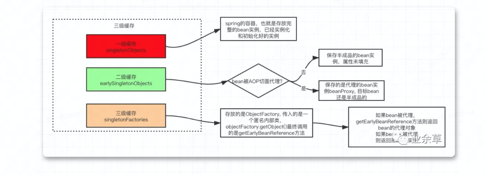
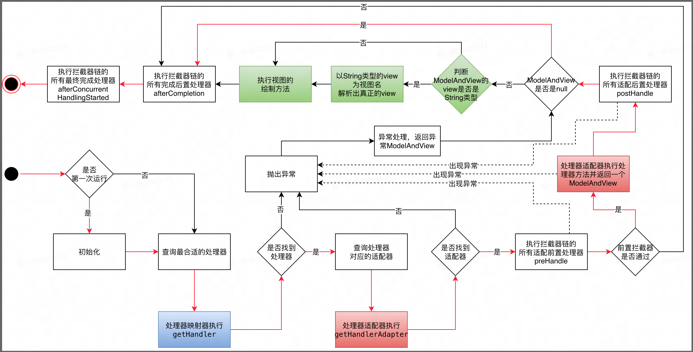

# Spring

- [Spring](#Spring)  
  - [Spring的重要模块](#Spring的重要模块)
  - [Spring IOC](#Spring-IOC)
    - [Spring IOC的意义](#Spring-IOC的意义)  
    - [Spring IOC的实现流程](#Spring-IOC的实现流程)
  - [Spring的核心接口](#Spring的核心接口)
  - [Spring 框架中的设计模式](#Spring框架中都用到了哪些设计模式)
  - [Spring Bean](#Spring-Bean)
    - [Spring bean的作用域 ](#Spring-bean的作用域 )  
    - [Spring框架中的单例bean是线程安全的吗](#Spring框架中的单例bean是线程安全的吗)  
    - [bean的生命周期](#bean的生命周期)
  - [@Autowired 和@Resource](#@Autowired和@Resource)
  - [循环依赖怎么解决 ](#循环依赖怎么解决 )
    - [3级缓存 ](#3级缓存的作用，为什么不直接使用二级缓存呢？ )  
    - [为什么二三级都是hashmap，一级是concurrenthashmap？](#为什么二三级都是hashmap，一级是concurrenthashmap？)  
  - [spring aop ](#spring-aop)
    - [AOP代理 ](#AOP代理 )  
    - [动态代理的几种方式](#动态代理的几种方式)  
  - [spring 事务](#spring事务)
  - [mvc框架](#mvc框架)

## Spring的重要模块

| 模块           | 解释                                                         |
| -------------- | ------------------------------------------------------------ |
| spring-core    | 框架的基本组成部分，包括控制反转（IOC）和依赖注入（DI）功能  |
| spring-beans   | 提供了BeanFactory，是工厂模式的一个经典实现，Spring将管理对象称为Bean |
| spring-context | 构建于 core 封装包基础上的 context 封装包，提供了一种框架式的对象访问方法 |
| spring-aop     | 提供了面向切面的编程实现，可以自定义拦截器、切点             |
| spring-web     | 提供了针对 Web 开发的集成特性，例如文件上传，利用 servlet  listeners 进行 ioc 容器初始化和针对 Web 的 ApplicationContext |

## Spring-IOC

### Spring-IOC的意义

将对象的创建和管理交给IOC容器，由Spring负责创建、管理、装配对象，并且管理这些对象的整个生命周期。

### Spring-IOC的实现流程

| 步骤       | 解释                                                         |
| ---------- | ------------------------------------------------------------ |
| 配置文件   | 需要在Spring的配置文件中定义bean。这个配置文件可以是XML文件，也可以是注解或Java配置类。 |
| 创建容器： | 需要创建一个Spring IOC容器，这个容器可以是BeanFactory或ApplicationContext的实例。在创建容器的过程中，Spring会读取配置文件，解析bean的定义，并创建这些bean。 |
| 获取bean   | 从IOC容器中获取bean。这个过程是通过调用getBean()方法实现的。在这个过程中，Spring会负责bean的生命周期和依赖注入。 |

 

## Spring的核心接口

BeanFactory和ApplicationContext是Spring的两大核心接口，都可以当做Spring的容器。其中ApplicationContext是BeanFactory的子接口。

## Spring框架中都用到了哪些设计模式

| 设计模式 | 解释                                                    |
| -------- | ------------------------------------------------------- |
| 工厂模式 | BeanFactory就是简单工厂模式的体现，用来创建对象的实例   |
| 单例模式 | Bean默认为单例模式                                      |
| 代理模式 | Spring的AOP功能用到了JDK的动态代理和CGLIB字节码生成技术 |

##  Spring-Bean

### Spring-bean的作用域

Spring框架支持以下五种bean的作用域：

singleton : bean在每个Spring ioc 容器中只有一个实例。

prototype：一个bean的定义可以有多个实例。

request：每次http请求都会创建一个bean，该作用域仅在基于web的Spring ApplicationContext情形下有效。

session：在一个HTTP Session中，一个bean定义对应一个实例。该作用域仅在基于web的Spring ApplicationContext情形下有效。

global-session：在一个全局的HTTP Session中，一个bean定义对应一个实例。该作用域仅在基于web的Spring ApplicationContext情形下有效。

注意： 缺省的Spring bean 的作用域是Singleton。使用 prototype 作用域需要慎重的思考，因为频繁创建和销毁 bean 会带来很大的性能开销。

### Spring框架中的单例bean是线程安全的吗？

不是，单例bean非线程安全，主要看bean本身是否是有状态的，有状态并发修改就会有并发问题

### bean的生命周期

bean 标签有两个重要的属性（init-method和destroy-method）。用它们你可以自己定制初始化和注销方法。

它们也有相应的注解（@PostConstruct和@PreDestroy）。

## @Autowired和@Resource

Autowired的装配过程，和Resource的区别

Autowired优先按类型装配，如果查找到多个，就按名称装配

Resource默认按名称装配，找不到的情况下按类型装配

## 循环依赖怎么解决

Spring 中的三级缓存是针对 bean 的加载和创建过程而设计的。

在 Spring 容器中，每次请求获取一个 bean 时，Spring 首先检查一级缓存、二级缓存和三级缓存中是否已经存在该 bean，如果存在，则直接返回缓存中的实例对象，否则才进行 bean 的创建。

singletonObjects 缓存：一级缓存，也称为“单例池”，用于存储所有单例 bean 的实例对象。

earlySingletonObjects 缓存：二级缓存，也称为“早期单例对象池”，用于存储正在创建过程中的单例 bean 实例。

singletonFactories 缓存：三级缓存，也称为“单例工厂池”，用于存储用于创建单例 bean 的 ObjectFactory。

 

### 3级缓存的作用，为什么不直接使用二级缓存呢？

当bean被AOP代理的情况下，二级缓存无法解决，因为objectFactory.getObject方法对于代理对象每次返回的都是一个新对象，不满足单例条件

 

 

### 为什么二三级都是hashmap，一级是concurrenthashmap？

| 缓存类型 | 原因                                                         |
| -------- | ------------------------------------------------------------ |
| 一级     | 一级缓存SingletonObjects使用ConcurrentHashMap是因为它需要处理并发操作。  在Spring容器运行过程中，可能会有多个线程同时从容器中获取Bean，这就需要一级缓存具备线程安全的特性。 |
| 二三级   | 二级缓存EarlySingletonObjects和三级缓存SingletonFactories使用HashMap  是因为它们主要在Bean的创建过程中使用，这个过程是单线程的。 |

## spring-aop

基础的比如，spring aop的切面、切点、通知、连接点等概念，通知类型等，需要有一定了解

### AOP代理

主要分为静态代理和动态代理

| 代理类型 | 解释                                                         |
| -------- | ------------------------------------------------------------ |
| 静态代理 | AspectJ  AOP框架会在编译阶段生成AOP代理类，因此也称为编译时增强  会在编译阶段将AspectJ(切面)织入到Java字节码中，运行的时候就是增强之后的AOP对象。 |
| 动态代理 | Spring AOP  AOP框架不会去修改字节码，而是每次运行时在内存中临时为方法生成一个AOP对象  这个AOP对象包含了目标对象的全部方法，并且在特定的切点做了增强处理，并回调原对象的方法。 |

 

### 动态代理的几种方式

| 模式            | 解释                                                         |
| --------------- | ------------------------------------------------------------ |
| JDK动态代理     | 只提供接口的代理，不支持类的代理。  核心InvocationHandler接口和Proxy类  InvocationHandler  通过invoke()方法反射来调用目标类中的代码，动态地将横切逻辑和业务编织在一起  Proxy利用 InvocationHandler动态创建一个符合某一接口的的实例，生成目标类的代理对象。 |
| CGLIB字节码生成 | CGLIB（Code Generation Library），是一个代码生成的类库，  可以在运行时动态的生成指定类的一个子类对象，并覆盖其中特定方法并添加增强代码，从而实现AOP。  CGLIB是通过继承的方式做的动态代理，因此如果某个类被标记为final，那么它是无法使用CGLIB做动态代理的。 |

 

## spring事务

声明式事务、编程式事务

Spring事务的本质其实就是数据库对事务的支持，没有数据库的事务支持，spring是无法提供事务功能的。

事务传播行为

事务隔离级别

## mvc框架

Model（模型）：表示领域信息的对象，包含除了用于UI部分的所有数据和行为。可以简单理解为后端的Service层和Dao层。
 View（视图）：表示UI中模型的显示。可以简单理解为前端页面，包括html静态页面，jsp动态页面等。
 Controller（控制器）：接收用户输入，操作模型，并使视图更新。可以简单理解为后端的web交互层。

在前后端分离的架构下，V已经名存实亡，我们只需要关注MC即可

DispatchServlet的生命周期

视图处理相关可以忽略

总结来说，http请求进入Servlet之后，会经历如下阶段：

处理器映射器寻找 -》 处理器适配器寻找 -》 拦截器前置处理 -》 适配器执行处理器方法 -》 拦截器后置处理 -》 拦截器链的最终后置处理

处理器映射器寻找：找到对应的controller

处理器适配器寻找：找到对应的参数解析器，比如RequestParam、RequestBody

拦截器前置处理：拦截器是springmvc实现的preHandle

适配器执行处理器方法：具体的controller及service逻辑

拦截器后置处理：拦截器是springmvc实现的postHandle

拦截器链的最终后置处理：afterCompletion

 
